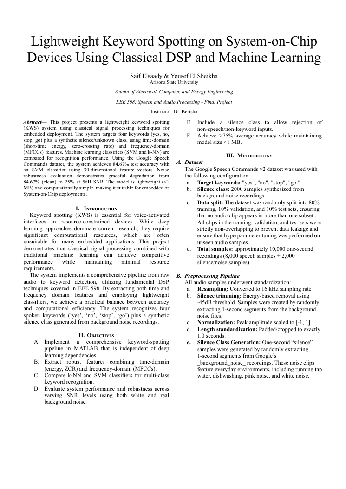

# Speech & Audio ML — Keyword Spotting

> Coursework project. Area: software, ml, audio.

## Overview
This repository contains my project deliverables (pulled from my own project files).

## Tools & Tech
- MATLAB
- PDF report
- Python
- report (Word)

## Repository Structure
```
docs/EEE 598 - Final Project Report-2.docx.pdf
docs/EEE598_Final_Project_Proposal.pdf
docs/FinalProject.docx
docs/Kws Project Plan (1).pdf
docs/Lightweight Keyword Spotting Using Energy and MFCC Features for Embedded Deployment (1).pdf
images/preview.png
src/Autocorr_Demo.m
src/EEE598_Final_Project.m
src/Filtering_Demo.m
src/Fourier_Demo.m
src/OLA_Demo.m
src/Phase1_Preprocessing_Script.py
src/Phase2_Feature_Extraction.py
src/Phase3_Classifier_Training.py
src/Phase4_Testing_Final_Evaluation.py
src/Quantization_Demo.m
src/Spectrogram_Demo.m
src/Speech_AutocorrAMDF_Demo.m
src/Speech_Quantization_Demo.m
src/ZCR_Energy_Demo.m
src/cepstrum.m
src/cross_synthesis.m
src/plot_fft.m
src/source_filter.m
```

## Code
Source is in `src/`. Provided as submitted; not independently re-run here.

## Results
See `docs/EEE 598 - Final Project Report-2.docx.pdf`.

## Preview


## License
MIT — see `LICENSE`.

---
_Part of my engineering coursework portfolio. Deliverables only._